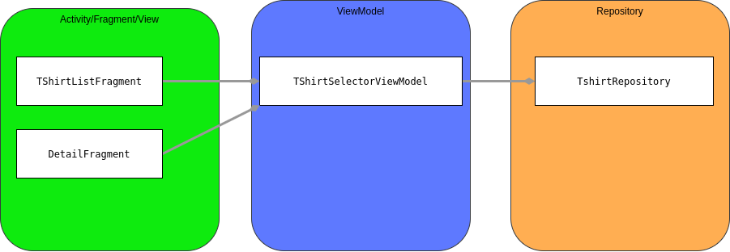

# Presentation Mobile Development
## Motivation & Information
This repository was made during a lecture (Mobile Application Development) at Munich University of Applied Sciences. 
This is intended to bring the subject of LiveData closer to the students. It's created by a student, so it might not be suitable as reference, but is designed as orientation for working with LiveData in Android projects.

The personal motivation was to make it easier for other students to work with LiveData.
Core concepts I want to share are:
* What is LiveData?
* Where is LiveData used in an App / How to use LiveData?
* some hints for working with LiveData

## LiveData
The base concept of LiveData can be read on the official Documentation of Android as well. I highly recomend, to read the article, before working with LiveData.
[LiveData by the android docs](https://developer.android.com/topic/libraries/architecture/livedata)
The following will explain the Basics also.

### Observer-pattern
This UML-Diagram shows the basic idea of the Observer Pattern.
LiveData would be the subject in this case and someone (observer) can observe the LiveData's information.

[read more about the Observer Pattern](https://en.wikipedia.org/wiki/Observer_pattern)

### Lifecycle awareness
LiveData will "notify" observers only when their LifeCycle is not in a Dead-State or PAUSED.
LifeCycles are provided usually by Activities and Fragments. 
That's why passing a LifeCycle is mandatory to observe LiveData.
The only exception is the "Observe forever" method, which can be used without a LifeCycle.

[read more about LifeCycles](https://developer.android.com/topic/libraries/architecture/lifecycle)

### Code examples
#### Create MutableLiveData
> val liveData = MutableLiveData<String>().apply{ value = "Hello World" }
#### create not mutable LiveData 
  
>@Query("SELECT * FROM PERSON ORDER BY NAME")  
>LiveData<List<Person>> loadAllPersons();
  
#### combine mutable and immutable LiveData
>//don't let anyone see the MutableLifeData   
private val privateLiveData = MutableLiveData<String>().apply{
			value = "Hello World"
			}  
  //show not mutable LiveData only  
			val publicLiveData : LiveData<String> = privateLiveData	  
  //to edit the LiveData's value, use the visible method  
			fun changeString(string : String){
			privateLiveData.postValue(string)
			}
#### observe LiveData
> //create an observer:  
  val nameObserver = Observer<String> { newName ->  
  &nbsp;&nbsp;&nbsp;&nbsp;
  //assign your observed value, to a view element  
  &nbsp;&nbsp;&nbsp;&nbsp;
  nameTextView.text = newName  
    		}  
			currentName.observe(lifeCycleOwner, nameObserver)  
##### observing LiveData indirectly
> // not observed  
			val name = repository.currentName  
			// make line above observing indirectly  
			val nameLetters = name.observe(lifeCycleOwner,Observer{  
      &nbsp;&nbsp;&nbsp;&nbsp;
			it.toCharArray().asList()  
			}  
	
#### Observe LiveData with Databinding
It is also very common to observe data from the view. Therefore I'd like to refer to an article about "[Use LiveData to notify the UI about data changes](https://developer.android.com/topic/libraries/data-binding/architecture#livedata)".

## T-Shirt App
### Idea
To share the idea of using LiveData, I created a simple T-Shirt app.  
The app is not realy practical, but the code I used, should show how LiveData can be used.  
To get the basic idea of the app, here are some screenshots:  

  
There are 3 fragments. The first and the second fragment show the exact same content and identical behaviour. The only difference between them is the implementation of it. The first, observes the values in the ViewModel with databinding. The code is written in the xml file of the View. For the second implementation, the code is written in the fragment file itself.  
The first approach is the most common approach.  

The third fragment, is an overview of T-Shirts in the repository. The details fragment below can be changed by clicking on a T-shirt in the third fragment. The T-shirt's color, the color value, and the size will change immediately.  
A LiveData value in the ViewModel will be updated, by clicking on a T-shirt. By updating the value, the observer in the view gets notified and updates its values on its own.

Under the third fragment is a "Add Random T-Shirt" Button. When it is clicked, a T-shirt with random hex-color and size will be added to the repository. The change in the repository also will notify all observers and indirect observers, and thus they will change. 

### Architecture:
Here are screenshots, how LiveData fits into the architecture of the app:  
  
  

## Summary
* check LifeCycle  
no observation when LifeCycle is Paused
* pass LifeCycle to binding
* check if LiveData is observed  
not observed LiveData does not change  
check also the methods of LiveData  
hasActiveObservers() & hasObservers()
* check value is in proper Type in xml  
android:text = "@\{viewmodel.number\}"  
android:text = "@\{viewmodel.number.toString()\}"  
(android:text expects a String)  
* check Livedata is not mutable accidentally
